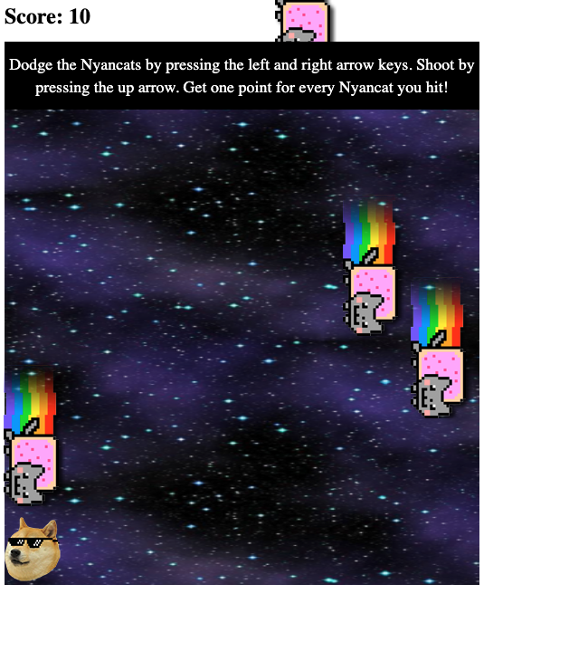

# Object Oriented Programming Game Project

# Introduction

In this game, you are a dog (ahem, doge) that must avoid the nyancats to stay alive. You can move by pressing the left and right arrow keys. Shoot cheezburgers at the nyancats by pressing the up arrow key. If you hit a nyancat, they disappear from the playing field and you score a point! 

Make sure to dodge the nyancats carefully. If one hits you, the game ends.

## Modifications

Aside from fixing the game functionality provided in the original file, I made the following modifications:

- Added a header bar with instructions for playing 
- Swapped out the player graphic from cheezburger to doge
- Added ability to shoot cheezburgers at the nyancats
- Ensuring both the nyancat and cheezburger disappear from the playing field if they collide
- Tallying a score that increases by one point each time you hit a nyancat
- Increased the size of the playing field and the number of nyancats that can appear at any given time
- Added sound effects each time you fire a cheezburger, hit a nyancat, and at the end of the game

## Netlify Link

https://jonisadlernyancatgame.netlify.app/
